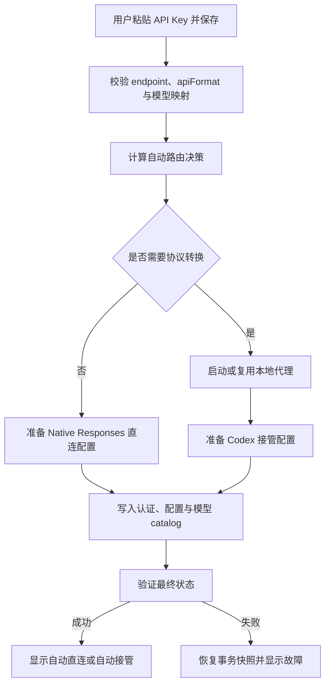

# Chimera++ v2.1.0 升级计划

> 文档状态：候选收口 / 发布前双盲审计
> 目标版本：v2.1.0
> 基线版本：v2.0.14
> 编写日期：2026-08-01
> 上游同步基线：CC Switch v3.19.1（2026-07-31）
> 构建原则：本地不构建、不打包；验证与产物生成全部在 GitHub Actions 完成。

## 0. 候选收口与双盲审计状态（2026-08-01）

### 0.1 已落地范围

- 已收口的实现方向包括：Skill 数据一致性与迁移清理、ZIP/symlink/junction 边界防护、备份恢复 staging、原子文件写入、Portable Codex root 校验、MCP/deeplink/配置输入校验，以及 Codex 进程识别、关闭和重启目标绑定。
- 发布链路已加入版本/tag/CI 可达性检查、候选构建、SBOM、checksum、build provenance、Codex mirror provenance；本轮进一步加入 updater `.sig` 的 minisign 密码学校验、`latest.json` 精确资产/签名绑定和签名密钥格式归一化。
- 以上是代码与静态审计状态，**不是**本轮构建、测试或发布成功的证据；所有证据必须来自将要发布 commit 的 GitHub Actions。

### 0.2 尚未关闭的风险

1. 前端 CI 具备格式、typecheck、unit tests，但仓库没有独立 lint 工具/脚本；CI-002 不能视为完成。
2. 跨平台故障注入未形成完整矩阵，尤其是文件锁/sharing violation、rename 失败、代理启动失败、关闭超时和新进程立即退出。
3. 分支保护已有 required checks 与严格状态检查，但未要求批准评审或 Code Owners；未经明确授权不调整仓库治理策略。
4. v2.1.0 仍必须完成当前 commit 的 main CI、双平台 candidate、v2.0.14 升级/人工验收后才能创建 `v2.1.0` tag；正式 release 之后还要复核实际上传资产、签名与 `latest.json`。

## 1. 版本目标

v2.1.0 的核心目标不是增加一个需要用户理解的“本地路由”开关，而是把供应商切换升级为一套**自动决策、原子执行、可恢复**的连接流程：

1. 用户新增第三方供应商时，只需填写供应商信息、粘贴 API Key 并保存。
2. Chimera++ 根据协议能力自动选择 Native Responses 直连或本地协议转换。
3. 切换供应商时自动处理代理生命周期、Codex 接管、认证文件、模型目录和配置写入。
4. 从第三方供应商切回官方账户、再切回第三方供应商时，应直接恢复可用状态；不得无故落入 Codex 登录页。
5. 非 GPT 模型应按实际模型名称和映射展示，不得统一退化为一个“自定义”。
6. 修复 Codex/ChatGPT 启动与重启：如果目标进程已运行，先完整关闭旧实例，再启动并验证新实例。
7. 同步 CC Switch v3.19.x 中与 Chimera++ 有关的安全、Codex、代理和供应商能力更新。

该版本属于用户流程和路由架构升级，采用 **v2.1.0**，不作为 v2.0.x 补丁发布。

## 2. 背景与问题陈述

### 2.1 当前已确认的问题

| 问题 | 当前表现 | 根因判断 | v2.1.0 处理方向 |
| --- | --- | --- | --- |
| 第三方账户切回后出现登录页 | 官方账户 → 第三方供应商时未直接恢复 | 供应商切换、OAuth 保留、第三方认证和路由启动不是一个完整事务 | 建立统一切换编排器，执行前检查、失败回滚 |
| 非 GPT 模型只显示“自定义” | 已填写多个模型映射，模型选择器仍只显示一个“自定义” | 缺少官方身份时，Codex Desktop 对模型目录/认证状态回落；配置、catalog 与 auth 状态未统一验证 | 把认证修复、catalog 写入和模型验证纳入切换事务 |
| 新前端没有本地路由能力 | 正式入口只使用 `ChimeraApp`，设置页无路由状态与控制 | 旧代理 UI 仍在仓库，但未迁移到新前端 | 不恢复面向普通用户的总开关；接入自动路由状态 UI 与高级覆盖项 |
| 后端能力存在但不可感知 | `start_proxy_server`、`stop_proxy_server`、`get_proxy_status` 等命令仍存在 | 前端集成和自动决策层缺失，不是代理后端整体缺失 | 复用后端模块，新增路由策略和事务编排层 |
| 启动/重启没有刷新现有实例 | Codex 已运行时点击启动可能只聚焦旧实例 | 前端仅在 `codexRestartRequired=true` 时要求重启，后端默认允许打开现有实例 | 统一为受控生命周期：关闭确认 → 启动确认 → 新实例验证 |
| 上游差异持续扩大 | CC Switch v3.18.0 → v3.19.1 共 189 个文件变化 | Chimera++ 分叉后只同步了部分模块 | 按安全、Codex、代理、供应商分批人工融合，不整仓覆盖 |

### 2.2 当前代码基线

- 正式前端入口：`src/App.tsx` → `src/ChimeraApp.tsx`。
- 当前主视图类型：`providers | runtime | usage | appearance | settings`，没有 routing/proxy 页面。
- 当前设置页面：`NewSettingsView`，未接入 `enableLocalProxy`、接管状态或代理状态。
- 旧实现仍保留在：
  - `src/components/settings/SettingsPage.tsx`
  - `src/components/settings/ProxyTabContent.tsx`
  - `src/components/proxy/ProxyPanel.tsx`
  - `src/hooks/useProxyStatus.ts`
- 后端代理命令仍在 `src-tauri/src/commands/proxy.rs`，并已在 `src-tauri/src/lib.rs` 注册。

结论：本次不是“重新开发一套代理”，而是补齐新前端迁移、自动路由策略、切换事务和上游安全同步。

## 3. 产品原则

### 3.1 默认零决策成本

普通用户不需要理解以下概念：

- 本地代理；
- Responses API 与 Chat Completions 的区别；
- 协议转换；
- Codex 接管；
- auth.json 与 config.toml 的关系。

普通流程固定为：

```text
填写供应商 → 粘贴 API Key → 保存 → Chimera++ 自动完成连接
```

### 3.2 自动优先，高级覆盖

内部设置模型统一为：

```ts
type RoutingMode = "auto" | "direct" | "takeover";
```

- `auto`：默认。由 Chimera++ 根据供应商协议和运行时状态自动决策。
- `direct`：高级选项。强制 Native Responses 直连，仅用于排障或已知兼容场景。
- `takeover`：高级选项。强制本地路由接管，仅用于排障或特殊供应商。

普通设置页不展示三态选择；高级选项放入“高级/诊断”区域，并明确提示错误覆盖可能导致连接失败。

### 3.3 状态而不是开关

普通用户看到的是系统结果：

- `自动直连`
- `自动接管`
- `正在配置`
- `等待官方登录`
- `连接异常`

不展示“是否开启本地路由”的主开关，避免用户因不了解协议而关闭必需能力。

### 3.4 安全失败

- 不能先写入依赖代理的 live config，再尝试启动代理。
- 代理启动失败时，不得留下不可用的 Codex 配置。
- 写配置、写认证、写模型目录、启用接管必须支持回滚。
- 日志、deeplink、共享配置和错误信息不得泄漏 API Key、Token 或 OAuth 数据。

## 4. 成功指标

### 4.1 用户体验指标

1. 新建常见第三方供应商时，除 API Key 与必要 endpoint 外，无需设置路由参数。
2. 官方账户与第三方供应商连续往返切换 20 次，不出现非预期登录页或失效配置。
3. 配置两个或以上模型映射后，模型目录和选择器能显示对应模型，不合并为单一“自定义”。
4. 自动路由失败时，UI 给出可执行的原因和恢复动作，不要求用户猜测是否打开代理。

### 4.2 工程指标

1. 供应商切换核心路径具有事务测试和故障注入测试。
2. 路由策略使用纯函数测试覆盖所有 `apiFormat × routingMode` 组合。
3. 敏感字段在日志、deeplink、错误输出和共享配置中均有回归测试。
4. GitHub Actions 在 Windows x64、Windows ARM64 和 macOS Universal 上生成可安装产物。
5. 已运行的 Codex 上点击启动或重启，旧进程必须先完全退出，再出现唯一的新实例。
6. 发布前 CI、测试构建、升级兼容和签名产物检查全部通过。

## 5. 范围与非目标

### 5.1 本版本范围

- 自动路由策略与持久化模型。
- Codex 供应商切换事务及原子回滚。
- 新前端的路由状态、故障提示和高级覆盖入口。
- 官方 OAuth 保留、stale auth 清理与第三方认证修复。
- 模型映射、模型 catalog 与模型选择器状态的一致性修复。
- Codex/ChatGPT 启动、关闭、重启与进程唯一性验证。
- CC Switch v3.19.0/v3.19.1 的 P0 安全修复。
- DeepSeek、火山 Agentplan、腾讯混元 TokenHub 等 Native Responses 更新。
- GitHub Actions 验证门禁和发布文档。

### 5.2 非目标

- 不要求 Chimera++ 代替 Codex Desktop 完成或伪造官方 ChatGPT OAuth。
- 不把旧 `SettingsPage` 整页恢复为正式入口。
- 不直接合并 CC Switch v3.19.1 的全部 189 个文件。
- 不在 v2.1.0 重写整个代理内核或所有应用的前端。
- 不承诺未知协议供应商绕过兼容层后仍可直连。

## 6. 目标用户流程

### 6.1 新增第三方供应商



### 6.2 从官方账户切到第三方供应商

1. 读取并快照当前官方 OAuth、Codex 配置、模型目录、代理状态和接管状态。
2. 保留有效 OAuth，不把第三方 API Key 覆盖到官方 OAuth 结构中。
3. 清理会强制第三方供应商进入官方认证流程的 stale 字段，例如 `requires_openai_auth=true`。
4. 根据协议自动启动或复用路由。
5. 写入第三方 provider 配置、provider-scoped local token 和模型 catalog。
6. 验证 Codex 实际读取的供应商、模型与认证状态。
7. 任何一步失败时恢复快照。

### 6.3 从第三方供应商切回官方账户

1. 检查已保存的官方 OAuth 是否存在且结构有效。
2. 恢复官方 provider 配置并清除第三方专用 live auth。
3. 仅关闭 Codex 接管；如果 Claude、Gemini、GrokBuild 等仍依赖代理，则保持代理运行。
4. 若官方 OAuth 缺失或确实失效，显示 `等待官方登录` 并引导用户只登录一次。
5. 登录完成后自动检测并继续切换，不要求用户再次操作路由。

## 7. 自动路由决策

### 7.1 默认决策表

| `apiFormat` | `routingMode=auto` | 原因 |
| --- | --- | --- |
| `openai_responses` | `direct` | Codex 可原生使用 Responses 协议，无需转换 |
| `openai_chat` | `takeover` | 需要将 Codex 请求转换为 Chat Completions 兼容协议 |
| `anthropic` | `takeover` | 需要协议转换与兼容处理 |
| 未知/缺失 | `takeover` 或阻止保存 | 不得盲目直连；优先安全兼容，并提示补全协议 |

模型映射与路由决策必须解耦：

- `apiFormat` 决定传输协议与是否需要转换；
- 模型映射决定模型名如何展示和转发；
- “非 GPT 模型”不等于“必须显示自定义”，也不直接决定是否接管。

### 7.2 决策函数建议

```ts
function resolveRouting(
  apiFormat: ApiFormat | undefined,
  routingMode: RoutingMode,
): "direct" | "takeover" {
  if (routingMode === "direct") return "direct";
  if (routingMode === "takeover") return "takeover";

  switch (apiFormat) {
    case "openai_responses":
      return "direct";
    case "openai_chat":
    case "anthropic":
    default:
      return "takeover";
  }
}
```

后端应作为最终决策权威；前端可复用同一份类型和状态展示，但不能单独决定 live 配置。

## 8. 路由状态机

建议统一后端运行时状态：

```ts
type RoutingStatus =
  | { state: "idle" }
  | { state: "planning"; providerId: string }
  | { state: "starting_proxy"; providerId: string }
  | { state: "applying"; providerId: string; route: "direct" | "takeover" }
  | { state: "verifying"; providerId: string }
  | { state: "ready"; providerId: string; route: "direct" | "takeover" }
  | { state: "waiting_official_login" }
  | { state: "rolling_back"; providerId: string }
  | { state: "error"; providerId?: string; code: string; recoverable: boolean };
```

必须满足：

- 同一时间只允许一个切换事务修改 Codex live 配置。
- 重复点击同一供应商具有幂等性。
- 应用异常退出后，下次启动能检测未完成事务并恢复最后一个有效快照。
- 代理进程状态、端口可用性和接管配置必须交叉验证，不能只信任内存状态。

## 9. 数据模型与迁移

### 9.1 设置迁移

旧配置兼容规则：

```text
旧 enableLocalProxy = true  → routingMode = takeover
旧 enableLocalProxy = false → routingMode = auto
无旧值                      → routingMode = auto
```

迁移原则：

- 保留旧用户明确启用代理的意图，避免升级后突然直连。
- 旧“关闭代理”不再解释为永久禁止代理，而是升级为自动模式。
- 迁移只执行一次，并记录 schema version。
- 保留读取旧字段至少一个小版本，写入只使用新字段。

### 9.2 供应商能力元数据

建议为供应商建立明确能力结构，而不是依赖名称猜测：

```ts
type ProviderCapabilities = {
  apiFormat: "openai_responses" | "openai_chat" | "anthropic";
  supportsNativeResponses: boolean;
  requiresOfficialOAuth: boolean;
  supportsModelCatalog: boolean;
  endpointValidation?: "strict" | "compatible";
};
```

预设供应商可内置能力；自定义供应商保存时必须选择或可靠识别 `apiFormat`。

## 10. 供应商切换事务

### 10.1 事务边界

建议新增单一后端入口，例如：

```rust
switch_codex_provider_transaction(provider_id, options) -> SwitchResult
```

前端不得继续按顺序分别调用“写配置 → 写认证 → 启动代理”，否则中途失败会暴露半完成状态。

### 10.2 推荐执行顺序

```text
1. 获取全局切换锁
2. 读取目标 provider 和能力元数据
3. 校验 endpoint、API Key、模型映射
4. 快照 config.toml、auth.json、模型 catalog、代理与接管状态
5. 计算 direct/takeover 计划
6. 若需 takeover，先启动/复用代理并完成健康检查
7. 生成 provider-scoped local token（如需要）
8. 在临时文件中生成目标 config/auth/catalog
9. 校验临时文件可解析且敏感字段位置正确
10. 原子替换 live 文件
11. 启用或关闭 Codex 接管
12. 验证最终 provider、route、auth、catalog 和代理健康
13. 提交事务并清理快照
14. 失败时恢复所有快照和原接管状态
```

### 10.3 代理生命周期

- 需要接管且代理未运行：启动并健康检查。
- 需要接管且代理已运行：复用，不重复创建进程。
- 切换到 Native Responses：只解除 Codex 接管。
- 停止代理前检查 Claude、Gemini、GrokBuild 等应用是否仍被接管。
- 最后一个接管应用解除后，可根据设置延迟停止代理，避免频繁抖动。
- 端口冲突、进程失联和配置不一致必须有专用错误码。

## 11. OAuth 与认证策略

### 11.1 官方 OAuth 边界

Chimera++ 不伪造、不绕过官方 ChatGPT OAuth。产品承诺为：

- 首次没有官方 OAuth 时，引导用户在 Codex Desktop 登录一次；
- 登录后自动检测、保存并在后续切换中保留；
- 切到第三方供应商时不破坏官方 OAuth；
- 切回官方账户时优先恢复已保存 OAuth；
- 只有 OAuth 确实缺失或失效时才显示 `等待官方登录`。

### 11.2 第三方认证

- API Key 按 provider 隔离存储，不使用一个全局第三方 key 覆盖所有供应商。
- 本地代理 token 应按 provider 或会话作用域生成，不等同于用户原始 API Key。
- 写入 Codex live auth 前清理冲突字段和 stale `requires_openai_auth`。
- UI、日志、诊断导出、deeplink 和崩溃信息统一脱敏。

## 12. 模型映射与“自定义”修复

### 12.1 目标

供应商配置中的多个模型映射必须完整进入 Codex 模型 catalog，并能被运行时读取；不能因为模型不是 GPT 系列就统一显示为一个“自定义”。

### 12.2 统一链路

```text
Provider model mapping
→ normalize/validate
→ generate provider model catalog
→ atomic write
→ Codex runtime reload/restart signal
→ verify effective models
→ UI display effective model list
```

### 12.3 验证要求

- 两个映射输入产生两个稳定且唯一的模型条目。
- 模型 `id`、`display_name`、实际 upstream model name 各自语义明确。
- Native Responses 与接管模式使用同一模型映射来源。
- 切换供应商后旧 catalog 不污染新供应商。
- 缺少官方 OAuth 时，第三方 catalog 仍可验证；如果 Codex Desktop 有不可绕过的 UI 限制，Chimera++ 必须明确显示真实有效模型并解释限制，而不是静默显示“自定义”。
- 将 `codex debug models` 或等价后端解析结果纳入自动测试断言，而不是只检查文件已写入。

## 13. 新前端接入方案

### 13.1 不直接恢复旧路由页

旧 `SettingsPage` / `ProxyTabContent` 可作为能力参考，但不直接挂回主导航。原因：

- 旧设计把实现细节暴露给普通用户；
- 容易让用户错误关闭必需路由；
- 与“粘贴 Key 后自动完成”的产品目标冲突。

### 13.2 供应商卡片/详情页

新增紧凑状态：

- 当前连接方式：自动直连 / 自动接管；
- 运行状态：就绪 / 配置中 / 等待登录 / 异常；
- 生效模型数量；
- 失败时展示“重试”和“查看诊断”，不首先展示路由开关。

### 13.3 设置页

普通设置：

- 自动管理连接（固定启用，不做总开关）；
- 启动时自动修复未完成切换；
- 诊断状态和日志导出。

高级设置：

- 路由覆盖 `auto/direct/takeover`；
- 代理监听地址/端口等现有高级参数；
- 恢复默认自动策略；
- 清晰风险提示。

### 13.4 状态文案

| 内部状态 | 用户文案 | 首要动作 |
| --- | --- | --- |
| `ready/direct` | 自动直连 | 无 |
| `ready/takeover` | 自动接管 | 无 |
| `waiting_official_login` | 等待官方登录 | 打开 Codex 登录 |
| `starting_proxy` / `applying` | 正在配置连接 | 禁止重复切换，允许取消后回滚 |
| `error` | 连接异常 | 重试 / 查看诊断 / 恢复上一个可用配置 |

## 14. CC Switch v3.19.x 同步计划

### 14.1 同步策略

- 以 `v3.19.1` 为固定审计基线，不追逐开发分支。
- 先建立 commit/file 对照表，再按模块 cherry-pick 或人工移植。
- 与 Chimera++ 自有认证、官方账户切换和新前端冲突的代码必须人工融合。
- 每一组同步独立提交，便于回滚和定位回归。
- 禁止直接用上游整文件覆盖 Chimera++ 的认证与 provider service。

### 14.2 P0 安全同步

必须在功能发布前完成：

- Skill ZIP Slip/path traversal 防护。
- archive 大小、条目数、解压预算和 symlink 限制。
- repo owner/name/branch/directory 参数校验。
- Gemini shared config 凭据泄漏修复和一次性清洗。
- GrokBuild deeplink/env 凭据泄漏修复。
- SQL 跨库导入拒绝。
- terminal cwd 命令注入修复。
- deeplink 敏感字段脱敏和风险确认。
- malformed Codex/Anthropic/MCP 配置 panic 防护。

当前缺失/待核对的上游符号包括：

```text
MAX_ARCHIVE_ENTRIES
extract_repo_archive
require_valid_directory
is_valid_git_branch
scrub_leaked_gemini_common_config
upsert_mcp_server_table
remove_mcp_server_from_doc
```

每项必须包含：移植 commit、Chimera++ 适配说明、单元/集成测试和安全回归用例。

### 14.3 P1 Codex 与供应商能力

- DeepSeek Native Responses 与官方 catalog mirror。
- `codex_deepseek_catalog_template.json`。
- 火山 Agentplan 从 `openai_chat` 调整为 `openai_responses`。
- 腾讯混元 TokenHub：
  - `hy3`
  - `hy3-preview`
  - 256K 上下文
  - Native Responses
- 官方账户切换 stale auth 修复，需与 Chimera++ v2.0.14 的 `normalize_codex_third_party_auth_config()` 人工融合。
- Codex tool-result 媒体原生恢复。
- Codex fork rollout timeline cache。
- Claude Desktop proxy/session usage 去重。

### 14.4 延后项

纯 UI 结构、与 Chimera++ 新前端冲突且不影响安全/兼容性的上游改动，可延后到 v2.2.0 评估。

## 15. 分阶段实施

### Phase 0：基线与测试护栏

目标：在改变切换逻辑前锁定现有行为。

- [ ] 为官方 ↔ 第三方往返切换补集成测试。
- [ ] 为 auth/config/catalog 文件建立 fixture 与快照测试。
- [ ] 为代理启动失败、端口冲突、文件写入失败增加故障注入。
- [ ] 为多个模型映射增加回归测试。
- [ ] 审核 CI 触发规则，确保 pull request 也会运行必需门禁。
- [ ] 将 frontend unit tests、format check 纳入 GitHub CI。

退出条件：现有故障可由失败测试稳定复现。

### Phase 1：自动路由核心

目标：后端成为路由决策和切换事务的唯一权威。

- [ ] 新增 `routingMode` 与 schema migration。
- [ ] 实现纯路由决策函数及矩阵测试。
- [ ] 实现全局切换锁和事务快照。
- [ ] 实现临时文件校验、原子替换和完整回滚。
- [ ] 实现代理复用、多应用接管引用检查和健康检查。
- [ ] 对外暴露统一 switch/status/retry/restore 命令。

退出条件：无前端参与也能通过后端测试完成 direct/takeover 自动切换及回滚。

### Phase 2：新前端状态 UI

目标：用户只处理供应商和 API Key，不处理代理开关。

- [ ] 将自动路由状态接入 `ChimeraApp`。
- [ ] 在供应商详情显示自动直连/自动接管/故障。
- [ ] 增加等待官方登录流程和自动继续。
- [ ] 增加重试、恢复上一个可用配置和诊断入口。
- [ ] 把强制模式放入高级设置。
- [ ] 统一启动/重启入口：已运行时先关闭旧实例，再启动并验证新实例。
- [ ] 增加关闭、启动、验证阶段状态和稳定错误码。
- [ ] 删除或标记未挂载旧代理 UI，避免双套逻辑继续漂移。

退出条件：普通用户流程中不出现本地路由开关；启动或重启运行中的 Codex 时，不再只聚焦旧实例。

### Phase 3：OAuth 与模型选择器一致性

目标：修复登录页回退与单一“自定义”显示。

- [ ] 融合 v2.0.14 stale auth 清理与新事务逻辑。
- [ ] 保留、恢复并验证官方 OAuth。
- [ ] 统一模型 mapping → catalog → runtime 验证链路。
- [ ] 增加多模型、非 GPT 名称、供应商往返切换测试。
- [ ] 在 UI 中显示实际生效模型和 catalog 诊断结果。

退出条件：官方与第三方往返切换不再无故登录；多个模型可稳定读取和展示。

### Phase 4：CC Switch P0 安全同步

目标：完成 v3.19.x 相关安全基线。

- [ ] archive/Skill 提取安全。
- [ ] repo 与目录参数校验。
- [ ] Gemini/GrokBuild 凭据清洗。
- [ ] SQL/terminal/deeplink 注入与泄漏修复。
- [ ] malformed config 防 panic。
- [ ] 安全测试和迁移清洗测试。

退出条件：P0 清单全部有对应测试并通过 GitHub CI。

### Phase 5：CC Switch P1 Codex 同步

目标：补齐 Native Responses 和供应商能力。

- [ ] DeepSeek Native Responses。
- [ ] 火山 Agentplan Responses 更新。
- [ ] 腾讯混元 TokenHub。
- [ ] tool-result 媒体恢复与 rollout cache。
- [ ] usage 去重和相关回归。

退出条件：预设、catalog、路由决策和 usage 测试通过。

### Phase 6：发布准备

- [ ] 更新版本号：`package.json`、Tauri 配置、Cargo metadata 和锁文件。
- [ ] 编写 v2.1.0 中/英/日发布说明。
- [ ] 更新用户手册：粘贴 Key、自动路由、首次官方登录、故障恢复。
- [ ] 更新安全说明与上游同步记录。
- [ ] 在 GitHub Actions 生成 Windows/macOS 候选产物。
- [ ] 完成安装、升级、回滚和自动更新冒烟验证。

退出条件：所有发布门禁通过后才允许创建 `v2.1.0` tag。

## 16. GitHub Actions 验证矩阵

### 16.1 本地操作边界

本地允许：

- 编辑源码和文档；
- 查看 diff；
- `git diff --check` 等非构建型静态检查；
- Git 分支、提交和推送操作。

本地禁止：

- `pnpm build` / `pnpm tauri build`；
- Cargo 构建、测试、clippy、rustfmt 执行；
- 前端 typecheck、unit test 和打包；
- 生成或验证安装包。

所有构建、类型检查、格式检查、测试和产物生成统一交给 GitHub Actions。

### 16.2 PR 门禁建议

当前 `ci.yml` 仅配置 `push` 与 `workflow_dispatch`。v2.1.0 开发开始前应增加 `pull_request` 触发，并至少包含：

| Job | 平台 | 必需检查 |
| --- | --- | --- |
| Frontend validation | Windows 2022 | frozen install、typecheck、format check、unit tests |
| Backend validation | Windows 2022 | rustfmt、clippy `-D warnings`、Rust tests |
| Backend validation | macOS 15 | rustfmt、clippy `-D warnings`、Rust tests |
| Security regression | Windows/macOS | archive、deeplink、config、credential scrub tests |
| Switching integration | Windows/macOS | official/third-party、direct/takeover、rollback、multi-model |

### 16.3 候选构建

通过 `workflow_dispatch` 运行：

- Windows x64 测试安装包；
- Windows ARM64 测试安装包；
- macOS Universal 测试包；
- 上传短期保留的 GitHub artifact，供人工冒烟验证。

建议把现有只监听 `chimera/v2-backend` 的 test build workflow 改为可接收任意 release candidate branch 或显式输入 ref。

### 16.4 正式发布

1. PR CI 全绿并完成代码评审。
2. 候选构建和人工冒烟通过。
3. 合并到 `main`，再次等待 main CI 全绿。
4. 确认版本号、release notes 和 updater metadata。
5. 创建并推送 `v2.1.0` tag。
6. `release.yml` 在 GitHub 生成签名产物并发布 Release。
7. `latest.json` 汇总成功后验证自动更新。

禁止为了“试一下能否构建”在本机先跑构建。

## 17. 测试与验收标准

### 17.1 自动路由

- [ ] `openai_responses + auto` 自动直连。
- [ ] `openai_chat + auto` 自动接管。
- [ ] `anthropic + auto` 自动接管。
- [ ] 未知协议不会盲目直连。
- [ ] 高级覆盖 direct/takeover 生效且有风险提示。

### 17.2 切换与回滚

- [ ] 官方 → 第三方 → 官方 → 同一第三方可连续成功。
- [ ] 代理启动失败不改变原 live 配置。
- [ ] auth 写入失败时 config/catalog/接管状态全部恢复。
- [ ] 应用异常退出后可恢复最后一个有效状态。
- [ ] 多应用接管时切换 Codex 不误停共享代理。

### 17.3 OAuth 与模型

- [ ] 有效官方 OAuth 在第三方切换后仍被保留。
- [ ] 缺少 OAuth 时只进入一次明确的官方登录引导。
- [ ] 第三方切换清理 stale `requires_openai_auth`。
- [ ] 两个模型映射产生两个有效 catalog 条目。
- [ ] 非 GPT 模型显示真实名称，不统一退化为“自定义”。
- [ ] provider 间切换不残留上一供应商模型。

### 17.4 安全

- [ ] 恶意 archive 无法目录穿越、symlink 逃逸或资源耗尽。
- [ ] 非法 repo/branch/directory 参数被拒绝。
- [ ] 共享配置和 deeplink 不泄漏凭据。
- [ ] SQL 导入和 terminal cwd 不可注入。
- [ ] malformed 配置返回可诊断错误，不 panic。

### 17.5 发布

- [ ] Windows x64 安装与升级通过。
- [ ] Windows ARM64 安装与启动通过。
- [ ] macOS Intel/Apple Silicon 通过 Universal 包验证。
- [ ] 从 v2.0.14 升级后设置迁移正确。
- [ ] updater 签名和 `latest.json` 有效。

## 18. 可观测性与诊断

新增不含敏感值的结构化事件：

- route decision：输入协议、选择结果、覆盖来源；
- switch transaction：阶段、耗时、成功/回滚；
- proxy health：进程、端口、接管应用数量；
- auth state：仅记录类型和是否存在，不记录 token；
- catalog state：模型数量、provider ID、校验结果；
- error code：稳定错误码与用户可执行建议。

诊断导出必须二次脱敏，并提供用户预览。

建议错误码：

```text
ROUTE_UNSUPPORTED_FORMAT
PROXY_START_FAILED
PROXY_PORT_CONFLICT
PROXY_HEALTHCHECK_FAILED
AUTH_OFFICIAL_LOGIN_REQUIRED
AUTH_WRITE_FAILED
CONFIG_WRITE_FAILED
CATALOG_VALIDATION_FAILED
SWITCH_ROLLBACK_FAILED
```

## 19. 风险与缓解

| 风险 | 影响 | 缓解措施 |
| --- | --- | --- |
| 自动判断错误 | 供应商不可用 | 能力元数据优先；未知协议保守接管；高级覆盖 |
| 事务覆盖用户手改配置 | 用户配置丢失 | 文件快照、最小字段修改、原子替换、冲突检测 |
| 代理被其他应用共享 | 误停 Claude/Gemini 等 | 接管引用检查；只解除 Codex；最后使用者退出才停止 |
| OAuth 与第三方 auth 相互污染 | 登录页回退或官方登录失效 | 分层存储、明确清理规则、往返切换测试 |
| 上游大批同步引入回归 | 发布延期或功能破坏 | 按模块独立提交；P0/P1 分阶段；禁止整文件覆盖认证核心 |
| UI 与后端状态不一致 | 用户误判连接状态 | 后端状态为唯一事实源；事件推送 + 定期校验 |
| 前端 lint/故障注入缺口 | 低级静态问题或边界回归漏检 | 保留为 v2.1.0 发布阻断审计项；补齐工具与跨平台失败矩阵后才关闭 |
| 审批治理未强制 | 高风险变更可能缺少人工复核 | required checks 已启用；后续经仓库管理员授权后启用审批/Code Owners |
| GitHub workflow/候选证据不足 | 缺陷进入 main 或错误发布 | current commit CI、candidate、provenance、checksum 和 updater 签名均须由 Actions 可追溯；不得复用旧运行记录 |

## 20. 回滚策略

### 20.1 运行时回滚

- 每次切换前保存最后一个已验证快照。
- 回滚包含 config、auth、catalog、接管状态和代理生命周期。
- 若自动回滚失败，保留快照并显示恢复入口，不继续覆盖文件。

### 20.2 版本回滚

- v2.1.0 数据迁移必须向后兼容 v2.0.14 可读取的关键字段。
- 新字段使用独立 schema version，不删除旧字段备份直到一个稳定版本后。
- GitHub Release 保留 v2.0.14 安装包和更新元数据恢复方案。

## 21. 发布门禁

以下条件全部满足才允许发布：

1. P0 安全清单全部完成并有回归测试。
2. 自动路由与切换事务测试在 Windows/macOS 全绿。
3. 官方/第三方往返切换和多模型显示人工验收通过。
4. Windows x64、Windows ARM64、macOS Universal 候选产物均由 GitHub Actions 生成。
5. 从 v2.0.14 升级测试通过。
6. 无未解决的 P0/P1 缺陷。
7. 发布说明、用户手册、安全说明和上游同步记录完成。
8. main 分支 CI 全绿后才创建 tag。

## 22. 推荐提交拆分

为降低风险，建议按以下顺序提交或建立 PR：

1. `test: add codex switching and model catalog regression coverage`
2. `ci: enforce pull request validation and GitHub-only release gates`
3. `feat: add automatic routing policy and settings migration`
4. `feat: make codex provider switching transactional`
5. `feat: surface automatic connection state in Chimera UI`
6. `fix: make Codex launch and restart replace the running instance`
7. `fix: preserve official oauth and validate third-party model catalogs`
8. `security: sync CC Switch 3.19 archive and import hardening`
9. `security: scrub shared-config and deeplink credentials`
10. `feat: sync native Responses provider presets from CC Switch 3.19.1`
11. `docs: prepare Chimera++ 2.1.0 release`

认证核心和事务编排 PR 应保持可单独审查，避免与大规模 UI 改动混在同一提交中。

## 23. 决策摘要

v2.1.0 采用以下确定方案：

- 普通用户只需粘贴 API Key 并保存。
- 路由默认 `auto`，Chimera++ 自动选择直连或接管。
- 普通界面不提供本地路由总开关。
- 高级用户可强制 `direct` 或 `takeover`。
- 供应商切换由单一后端事务完成，并具备原子回滚。
- 官方 OAuth 仅在首次缺失或实际失效时要求用户登录。
- 模型映射、catalog、认证和路由统一验证，修复单一“自定义”显示。
- Codex/ChatGPT 已运行时，启动和重启都先完整关闭旧进程，再启动唯一的新实例。
- CC Switch v3.19.1 按 P0 安全、P1 Codex 能力分批人工融合。
- 本地不运行任何构建/测试；全部验证和产物生成在 GitHub Actions 完成。

## 24. Codex/ChatGPT 启动与重启生命周期修复

### 24.1 当前实现与根因

当前正式前端在 `src/ChimeraApp.tsx` 的 `openCodex` 中调用：

```ts
invoke("open_codex_runtime", {
  restartIfRunning: codexRestartRequired,
});
```

这意味着“是否重启”取决于是否有待应用的配置变更，而不是取决于用户点击的是“启动/打开”操作以及 Codex 是否已经运行。当前后端 `src-tauri/src/commands/codex_runtime.rs` 的 `open_codex_runtime(restart_if_running)` 在 `restartIfRunning=false` 且进程已运行时，会调用启动器的“打开/聚焦已有实例”语义；这正是用户看到点击启动后没有先杀进程再重启的原因。

当前已有 `close_codex_for_restart`，并且重启路径会尝试优雅关闭后检查进程，但两个入口的语义仍不统一：

- 普通“启动/打开”可能只聚焦现有进程；
- “重启”依赖特定状态或模型目录确认流程；
- 启动后只检查“进程是否存在”，没有统一验证新进程是否确实是关闭后的新实例；
- 前端按钮文案、后端 action 和用户预期不一致。

### 24.2 目标语义

对用户可见的“启动 Codex/ChatGPT”按钮，采用以下确定规则：

| 当前状态 | 用户操作 | 目标行为 |
| --- | --- | --- |
| 未运行 | 启动 | 启动唯一实例并等待就绪 |
| 已运行 | 启动 | 先关闭当前实例，确认完全退出，再启动新实例 |
| 已运行 | 重启 | 先关闭当前实例，确认完全退出，再启动新实例 |
| 关闭超时 | 启动/重启 | 不强行并发启动；显示关闭失败，允许重试或打开诊断 |
| 启动失败 | 启动/重启 | 保留可恢复状态，不留下“已启动”假状态 |

“启动”与“重启”在已有进程时都执行受控重启；两者差异只保留在 UI 文案和操作来源，不再改变安全的进程生命周期。

### 24.3 后端改造要求

建议将现有 `open_codex_runtime(restart_if_running)` 改为明确的启动策略，例如：

```rust
enum CodexLaunchIntent {
    EnsureRunning,
    Restart,
}
```

或者保留兼容参数，但最终统一映射为：

```text
EnsureRunning + 已运行 → Restart
Restart       + 已运行 → Restart
任意意图      + 未运行 → Launch
```

执行流程必须是：

```text
1. 获取跨进程运行时锁
2. 重新探测目标安装和当前 PID/进程集合
3. 若已运行，发送优雅退出
4. 等待目标进程集合完全为空
5. 超时后执行受控强制终止（仅限路径/安装标识匹配的 Codex 进程）
6. 再次确认进程完全退出
7. 启动 Codex
8. 等待新进程出现并稳定运行
9. 返回 action、旧 PID、新 PID、是否发生强制终止和最终状态
```

安全要求：

- 继续使用安装路径/包标识限定进程，不得用宽泛的 `taskkill /IM` 误杀其他 Electron、ChatGPT 或用户程序。
- 优先优雅退出，强制终止必须有超时、原因和日志标记。
- 对 portable、MSIX/标准安装分别实现准确的进程发现与关闭逻辑。
- 启动前必须确认旧进程已退出，禁止“旧实例还在 + 新实例已启动”的并发假成功。
- 启动后不仅检查“有进程”，还要检查新 PID/启动时间、安装路径和必要的健康状态。
- 运行时锁必须覆盖“关闭 → 等待 → 启动 → 验证”的完整窗口，避免重复点击产生竞态。

### 24.4 前端改造要求

- 点击“启动 Codex”时，前端只发送用户意图，不再根据 `codexRestartRequired` 自行决定是否重启。
- 后端返回 `launched`、`restarted`、`failed_to_stop`、`failed_to_start` 等稳定 action/error code。
- 当检测到已运行时，按钮可以直接显示“重启 Codex”，或统一显示“重新载入 Codex”；不得显示“已打开”而实际没有刷新配置。
- 执行期间锁定按钮并显示阶段：`正在关闭旧进程` → `正在启动` → `正在验证`。
- 启动/重启失败时刷新真实进程状态，不能把本地 loading 结束误当成成功。
- 成功 toast 必须区分“首次启动”和“已重启”，并可展示“已完成旧进程清理”。

### 24.5 测试与验收

- [ ] 未运行时点击启动只创建一个 Codex 实例。
- [ ] 已运行时点击启动会先看到旧进程退出，再出现新进程。
- [ ] 已运行时点击重启同样先退出、再启动，不能只聚焦旧实例。
- [ ] 连续快速点击启动/重启只执行一个生命周期事务。
- [ ] 优雅退出超时后，只终止路径/安装标识匹配的目标进程。
- [ ] 其他 Electron、ChatGPT、Claude、Gemini 或无关进程不被误杀。
- [ ] 关闭失败时不启动第二个实例，并给出可恢复错误。
- [ ] 启动失败时返回准确状态，下一次点击可以重试。
- [ ] portable 与标准/MSIX 安装分别覆盖进程发现、关闭和重启测试。
- [ ] Windows GitHub Actions 运行真实或可替换的进程生命周期集成测试；本地不执行构建或测试。

该修复与自动路由事务必须衔接：供应商切换需要重载 Codex 时，必须复用同一套“关闭确认 → 启动确认 → 健康验证”生命周期服务，不能再由前端另写一套重启逻辑。
